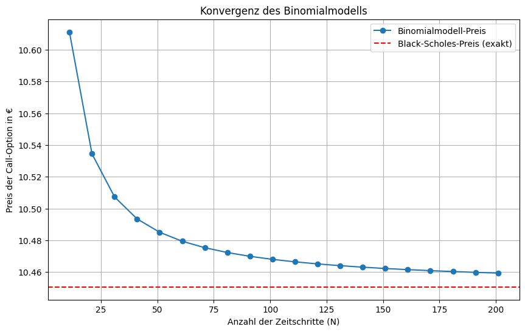

# Projekt: Optionspreise verstehen mit dem Binomialmodell

##Worum geht's in diesem Projekt?

Die Black-Scholes-Formel ist zwar berühmt, aber auch eine ziemliche "Black Box". Um wirklich zu verstehen, wie die Bewertung von Optionen fundamental funktioniert, habe ich in diesem Projekt das **Binomialmodell von Cox, Ross und Rubinstein** von Grund auf in Python implementiert.

Das Ziel war es, die Logik der risikoneutralen Bewertung und der Replikation von Payoffs Schritt für Schritt nachzuvollziehen und zu zeigen, wie sich dieses relativ einfache, diskrete Modell dem berühmten Black-Scholes-Preis annähert, wenn man die Zeitschritte verfeinert.

---

##Die Mathe dahinter

* **Binomialbaum:** Die Kernidee ist, die zufällige Bewegung eines Aktienkurses durch ein Gitter von einfachen Auf- (`u`) und Abwärtsbewegungen (`d`) über viele kleine Zeitschritte anzunähern.
* **Risikoneutrale Wahrscheinlichkeit (`q`):** Statt mit echten Wahrscheinlichkeiten zu arbeiten, berechnet man eine künstliche Wahrscheinlichkeit `q`, unter der der erwartete Aktienkurs genau die risikofreie Rendite erzielt. Das ist ein genialer Trick, um die subjektive Risikobereitschaft der Anleger aus der Formel zu eliminieren.
* **Rückwärts-Induktion:** Man startet am Ende der Laufzeit, wo der Wert der Option (der Payoff) für jeden möglichen Aktienkurs klar ist. Dann geht man den Baum Schritt für Schritt rückwärts und berechnet an jedem Knoten den diskontierten Erwartungswert der zukünftigen Optionswerte. Der Preis am Anfang des Baumes ist der faire Preis heute.

---

##Ergebnis

Die Implementierung berechnet den Preis einer europäischen Call-Option korrekt. Die Konvergenzanalyse zeigt eindrucksvoll, wie der Preis des Binomialmodells mit steigender Anzahl an Zeitschritten (`N`) gegen den analytisch exakten Black-Scholes-Preis konvergiert.

Zusätzlich habe ich die Sensitivitätskennzahlen **Delta** und **Gamma** ("Griechen") numerisch angenähert, was die praktischen Anwendungsmöglichkeiten des Modells im Hedging und Risikomanagement zeigt.

---

##Wie man's ausführt

Der Code ist in einem Jupyter Notebook (`.ipynb`) dokumentiert. Einfach das Repository klonen und die benötigten Pakete installieren:

`pip install -r requirements1.txt`
